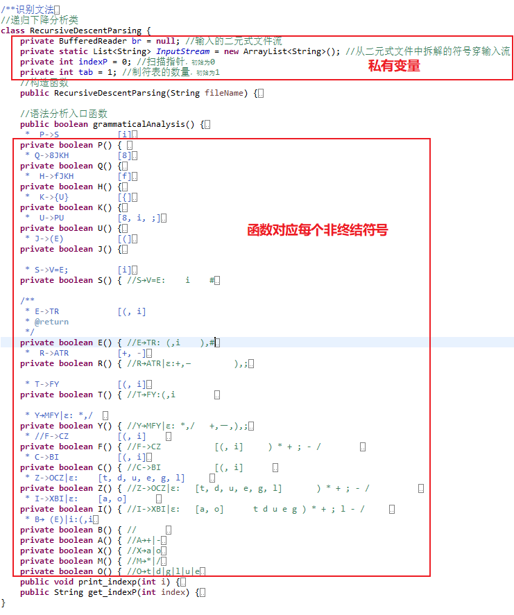
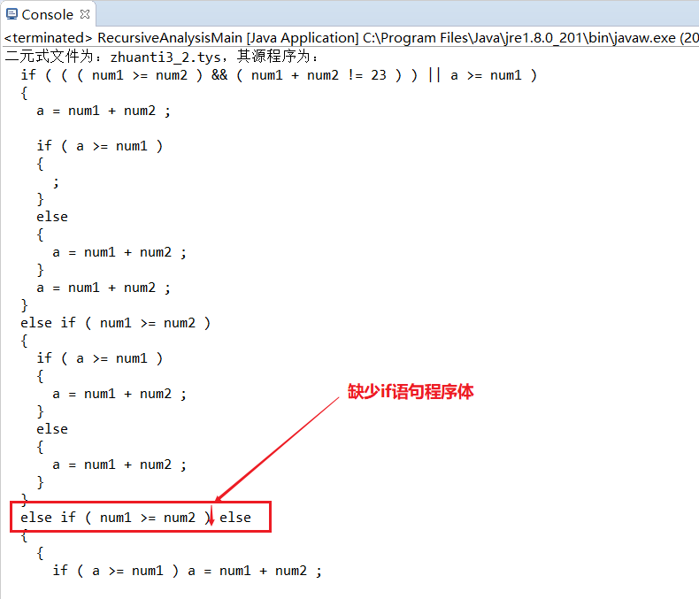
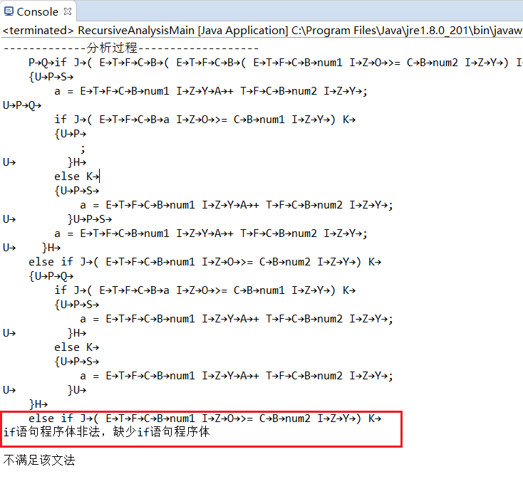

《编译原理》研究性学习专题实验报告

实验2*：递归下降语法分析设计原理与实现技术*

>   学 院：*计算机与信息技术学院*

>   专 业： *计算机科学与技术*

>   学生姓名： *杜永坤*

>   学 号： *16281002*

>   班 级： *计算机1601班*

>   指导教师： *于双元*

>   北京交通大学

>   2019年05月09日

### 实验要求：

###### 1、[实验项目]

完成以下描述赋值语句的LL(1)文法的递归下降分析程序

>   G[S]：

S→V=E

E→TE′

E′→ATE′\|ε

T→FT′

T′→MFT′\|ε

F→ (E)\|i

A→+\|-

M→\*\|/

>   V→i

###### 2、[设计说明] 

终结符号i为用户定义的简单变量，即标识符的定义。

###### 3、[设计要求]

（1）输入串应是词法分析的输出二元式序列，即某算术表达式“专题1”的输出结果，输出为输入串是否为该文法定义的算术表达式的判断结果；

（2）递归下降分析程序应能发现简单的语法错误；

（3）设计两个测试用例（尽可能完备，正确和出错），并给出测试结果；

（4）选做：如有可能，考虑如何用文法描述C语言的if语句，使整个文法仍然为LL1文法，并使得你的递归下降程序可以分析赋值语句和if语句。

### 实验过程：

#### 1、文法扩充修改

##### 1.1、修改文法：

*（4）选做：如有可能，考虑如何用文法描述C语言的if语句，使整个文法仍然为LL（1）文法，并使得你的递归下降程序可以分析赋值语句和if语句。*

针对（4）选做我对文法进行了扩充和修改

扩充修改后的文法：

基本可以识别c语言if语句、判断语句和赋值语句：

>   G[P]:

P→S\|Q\|;

S→V=E;

>   V→i

E→TR

R→ATR\|*\$*

T→FY

Y→MFY\|*\$*

F→CZ

Z→OCZ\|*\$*

C→BI

I→XBI\|*\$*

B→(E)\|i

A→+\|-

M→\*\|/

>   X→a\|o //a表示逻辑符号&&，o表示逻辑符号\|\|

>   O→t\|d\|g\|l\|u\|e //t表示\>=，d表示\<=，g表示\>,l表示\<,e表示==，u表示!=

Q→8JKH //8表示if在符号表中序号

H→fJKH\|9K\|*\$* //f 表示 else if符号的组合、9表示else在符号表中的序号

J→(E) //逻辑语句

K→S\|{U}\|; //if语句程序体

U→PU\|{U}U\|*\$*

##### 1.2、扩充后E表示的表达式可以识别逻辑表达式

规则：

>   F→CF′

>   F′→OCF′\|ε

>   C→BC′

>   C′→XBC′\|ε

>   X→a\|o//a表示逻辑符号&&，o表示逻辑符号\|\|

>   O→t\|d\|g\|l//t表示\>=，d表示\<=，g表示\>,l表示\<

将逻辑与（&&）和逻辑或（\|\|）加入到表达式中，将关系运算符（\<=、\>=、==、!=、\<、\>）加入到表达式中。

##### 1.3、if语句文法设计说明

>   Q→8JKH//8表示if在符号表中的序号

>   H→89JKH\|9K\|ε//9表示else在符号表中的序号

>   J→(E) //逻辑语句

K→S\|{U}\|; //if语句程序体

U→PU\|{U}U\|\$

这部分规则，表示的是if语句的识别规则：

Q→if\<判断语句\>\<IF语句程序体\>\<ELSE IF 或者 ELSE语句程序体\>

\<ELSE IF 或者 ELSE语句程序体\>→else if\<判断语句\>\<IF语句程序体\>\<ELSE IF
或者 ELSE语句程序体\>\|else\<IF语句程序体\>\|*\$*

\<判断语句\>→(E) //逻辑语句

\<IF语句程序体\>→S\|{U}\|; //if语句程序体

U→PU\|{U}U\|*\$*
//U这个部分保证了if语句程序体中能够出现赋值语句和if语句的闭包，并且能识别普通的程序体

3、

其中 S→V=E; 规则我在最后加入了 ;
终结符号，使所有的赋值表达式都比较符合c语言规则。

#### 2、**递归下降分析程序设计说明**

##### 2.1设计要求：

>   （1）输入串应是词法分析的输出二元式序列，即某算术表达式“专题1”的输出结果，输出为输入串是否为该文法定义的算术表达式的判断结果；

>   （2）递归下降分析程序应能发现简单的语法错误；

>   （3）设计两个测试用例（尽可能完备，正确和出错），并给出测试结果；

>   （4）选做：如有可能，考虑如何用文法描述C语言的if语句，使整个文法仍然为LL1文法，并使得你的递归下降程序可以分析赋值语句和if语句。

##### 2.2设计说明：

（1）该语言大小写不敏感；

（2）字母为a-zA-Z，数字为0-9；

（3）对上述文法进行扩充和改造；

（4）“/\*……\*/”为程序的注释部分;

（5）“/\*”作为左注释，“\*/”作为右注释，分别作为一种类别，所以左注释和右注释必须成对出现，否则错误；左右注释中字符忽略不进行识别；

（6）“//”作为单行注释，“//”后的字符忽略不进行识别。

（7）扩充后E表示的表达式可以识别逻辑表达式

>   规则：

>   F→CF′

>   F′→OCF′\|ε

>   C→BC′

>   C′→XBC′\|ε

>   X→a\|o//a表示逻辑符号&&，o表示逻辑符号\|\|

>   O→t\|d\|g\|l//t表示\>=，d表示\<=，g表示\>,l表示\<

将逻辑与（&&）和逻辑或（\|\|）加入到表达式中，将关系运算符（\<=、\>=、==、!=、\<、\>）加入到表达式中。

>   Q→8JKH//8表示if在符号表中的序号

>   H→89JKH\|9K\|ε//9表示else在符号表中的序号

>   J→(E) //逻辑语句

>   K→S\|{U}\|; //if语句程序体

>   U→PU\|{U}U\|\$

这部分规则，表示的是if语句的识别规则（将字母替换成文字意义的非终结符号）：

>   Q→if\<判断语句\>\<IF语句程序体\>\<ELSE IF 或者 ELSE语句程序体\>

>   \<ELSE IF 或者 ELSE语句程序体\>→else if\<判断语句\>\<IF语句程序体\>\<ELSE IF
>   或者 ELSE语句程序体\>\|else\<IF语句程序体\>\|*\$*

>   \<判断语句\>→(E) //逻辑语句

>   \<IF语句程序体\>→S\|{U}\|; //if语句程序体

>   U→PU\|{U}U\|*\$*
>   //U这个部分保证了if语句程序体中能够出现赋值语句和if语句的闭包，并且能识别普通的程序体

#### 3、**程序功能描述**

（1）、能够录入一个.tys文件中的二元式内容；

（2）、根据.tys文件内容进行语法分析，可识别

>   ①赋值表达式

>   ②逻辑表达式

>   ③c语言if语句；

（3）、根据输入的二元式内容进行分析语法分析，并打印结果；

（4）、打印分析过程和错误提示。

#### 4、**主要的数据结构描述**

##### 4.1主要使用的java数据结构类型

###### 4.1.1 List

###### list中添加，获取，删除元素

List\<String\> person=new ArrayList\<\>();

person.add("jackie"); //索引为0 //.add(e)

person.add("peter"); //索引为1

person.add("annie"); //索引为2

person.add("martin"); //索引为3

person.add("marry"); //索引为4

person.remove(3); //.remove(index)

person.remove("marry"); //.remove(Object o)

String per="";

per=person.get(1);

System.out.println(per); ////.get(index)

for (int i = 0; i \< person.size(); i++) {

System.out.println(person.get(i)); //.get(index)

}

###### list中是否包含某个元素

方法：.contains（Object o）； 返回true或者false

List\<String\> fruits=new ArrayList\<\>();

fruits.add("苹果");

fruits.add("香蕉");

fruits.add("桃子");

//for循环遍历list

for (int i = 0; i \< fruits.size(); i++) {

System.out.println(fruits.get(i));

}

String appleString="苹果";

//true or false

System.out.println("fruits中是否包含苹果："+fruits.contains(appleString));

if (fruits.contains(appleString)) {

System.out.println("我喜欢吃苹果");

}else {

System.out.println("我不开心");

}

###### list中根据索引将元素数值改变(替换)

.set(index, element); 和 .add(index, element); 的不同

String a="白龙马", b="沙和尚", c="八戒", d="唐僧", e="悟空";

List\<String\> people=new ArrayList\<\>();

people.add(a);

people.add(b);

people.add(c);

people.set(0, d); //.set(index, element);
//将d唐僧放到list中索引为0的位置，替换a白龙马

people.add(1, e); //.add(index, element);
//将e悟空放到list中索引为1的位置,原来位置的b沙和尚后移一位

//增强for循环遍历list

for(String str:people){

System.out.println(str);

}

###### list中查看（判断）元素的索引　

　　注意：.indexOf（）； 和 lastIndexOf（）的不同；

List\<String\> names=new ArrayList\<\>();

names.add("刘备"); //索引为0

names.add("关羽"); //索引为1

names.add("张飞"); //索引为2

names.add("刘备"); //索引为3

names.add("张飞"); //索引为4

System.out.println(names.indexOf("刘备"));

System.out.println(names.lastIndexOf("刘备"));

System.out.println(names.indexOf("张飞"));

System.out.println(names.lastIndexOf("张飞"));

###### 根据元素索引位置进行的判断

if (names.indexOf("刘备")==0) {

System.out.println("刘备在这里");

}else if (names.lastIndexOf("刘备")==3) {

System.out.println("刘备在那里");

}else {

System.out.println("刘备到底在哪里？");

}

###### 利用list中索引位置重新生成一个新的list（截取集合）

方法： .subList(fromIndex, toIndex)；　　.size() ； 该方法得到list中的元素数的和

List\<String\> phone=new ArrayList\<\>();

phone.add("三星"); //索引为0

phone.add("苹果"); //索引为1

phone.add("锤子"); //索引为2

phone.add("华为"); //索引为3

phone.add("小米"); //索引为4

//原list进行遍历

for(String pho:phone){

System.out.println(pho);

}

//生成新list

phone=phone.subList(1, 4); //.subList(fromIndex, toIndex)
//利用索引1-4的对象重新生成一个list，但是不包含索引为4的元素，4-1=3

for (int i = 0; i \< phone.size(); i++) { // phone.size()
该方法得到list中的元素数的和

System.out.println("新的list包含的元素是"+phone.get(i));

}

###### 对比两个list中的所有元素

　　//两个相等对象的equals方法一定为true,
但两个hashcode相等的对象不一定是相等的对象

//1.\<br\>if (person.equals(fruits)) {

System.out.println("两个list中的所有元素相同");

}else {

System.out.println("两个list中的所有元素不一样");

}

//2.

if (person.hashCode()==fruits.hashCode()) {

System.out.println("我们相同");

}else {

System.out.println("我们不一样");

}

###### 判断list是否为空

　　//空则返回true，非空则返回false

if (person.isEmpty()) {

System.out.println("空的");

}else {

System.out.println("不是空的");

}

##### 4.2 二元式文件结构

二元式文件通过专题1的词法分析程序得到：

其中一个测试用例为：

>   (8,if)

>   (3,()

>   (3,()

>   (3,()

>   (1,num1)

>   (24,\>=)

>   (1,num2)

>   (3,))

>   (41,&&)

>   (3,()

>   (1,num1)

>   (14,+)

>   (1,num2)

>   (28,!=)

>   (2,23)

>   (3,))

>   (3,))

>   (42,\|\|)

>   (1,a)

>   (24,\>=)

>   (1,num1)

>   (3,))

>   (3,{)

>   (1,a)

>   (23,=)

>   (1,num1)

>   (14,+)

>   (1,num2)

>   (3,;)

>   (8,if)

>   (3,()

>   (1,a)

>   (24,\>=)

>   (1,num1)

>   (3,))

>   (3,{)

>   (3,;)

>   (3,})

>   (9,else)

>   (3,{)

>   (1,a)

>   (23,=)

>   (1,num1)

>   (14,+)

>   (1,num2)

>   (3,;)

>   (3,})

>   (1,a)

>   (23,=)

>   (1,num1)

>   (14,+)

>   (1,num2)

>   (3,;)

>   (3,})

>   (9,else)

>   (8,if)

>   (3,()

>   (1,num1)

>   (24,\>=)

>   (1,num2)

>   (3,))

>   (3,{)

>   (8,if)

>   (3,()

>   (1,a)

>   (24,\>=)

>   (1,num1)

>   (3,))

>   (3,{)

>   (1,a)

>   (23,=)

>   (1,num1)

>   (14,+)

>   (1,num2)

>   (3,;)

>   (3,})

>   (9,else)

>   (3,{)

>   (1,a)

>   (23,=)

>   (1,num1)

>   (14,+)

>   (1,num2)

>   (3,;)

>   (3,})

>   (3,})

>   (9,else)

>   (8,if)

>   (3,()

>   (1,num1)

>   (24,\>=)

>   (1,num2)

>   (3,))

>   (3,;)

>   (9,else)

>   (3,{)

>   (3,{)

>   (8,if)

>   (3,()

>   (1,a)

>   (24,\>=)

>   (1,num1)

>   (3,))

>   (1,a)

>   (23,=)

>   (1,num1)

>   (14,+)

>   (1,num2)

>   (3,;)

>   (9,else)

>   (3,{)

>   (1,a)

>   (23,=)

>   (1,num1)

>   (14,+)

>   (1,num2)

>   (3,;)

>   (3,})

>   (3,})

>   (3,})

其源程序为：

>   if(((num1\>=num2)&&(num1+num2!=23))\|\|a\>=num1)

>   { //该部分对if语句程序进行赋值语句和if语句的循环套嵌进行测试

>   a = num1+num2;

>   if(a\>=num1)

>   { ; } //该部分对边缘性{;}语句进行测试

>   else

>   {

>   a = num1+num2;

>   }

>   a = num1+num2;

>   }

>   else if (num1\>=num2)//该部分对else if 语句进行。

>   {

>   if(a\>=num1)

>   {

>   a = num1+num2;

>   }

>   else

>   {

>   a = num1+num2;

>   }

>   }

>   else if (num1\>=num2)

>   ; //该部分进行了边缘性测试只有 ‘ ;’ 的语句

>   else

>   {

>   { //该部分进行了普通程序体测试，即{ }包括的程序语句。

>   if(a\>=num1)

>   a = num1+num2;//该语句测试单赋值语句与if语句的嵌套

>   else

>   {

>   a = num1+num2;

>   }

>   }

>   }

>   可见该if语句包含了许多特殊、复杂和边缘的情况，非常具有代表性。

>   二元式文件内容被录入到

>   **private static** List\<String\> *InputStream* = **new**
>   ArrayList\<String\>(); //从二元式文件中拆解的符号穿输入流

InputStream是一个Java
List列表的一个对象，list列表是一系列的String类型的字符串，具体的操作：

>   br = **new** BufferedReader(**new** InputStreamReader(**new**
>   FileInputStream(fp.getName())));

String erYuanShi = "";

**while**((erYuanShi=br.readLine())!=**null**) {

//截取符号串

*InputStream*.add(erYuanShi.substring(erYuanShi.indexOf(",") + 1,
erYuanShi.lastIndexOf(")")));

}

*InputStream*.add("\#"); //末尾添加\#号

br
为一个文件的读入流，通过使用br.readLine()方法读入二元式文件当前行内容并返回给String类型的变量erYuanShi，然后每一行的内容类似为(1,num1)的形式，但是我们需要就是num1，所以通过erYuanShi.substring(erYuanShi.indexOf(",")
+ 1,
erYuanShi.lastIndexOf(")"))方法将num1截取下来，放入List列表对象*InputStream*中，继续读文件，直到读取结束。这样就将二元式文件的内容读取到了List列表对象*InputStream中。*

然后每次分析当前符号的时候，都需要到列表对象*InputStream*中读取一个字符串进行分析，但是读取列表内容的时候，不能直接使用，因为，源程序和我们的文法有转换的地方，也就if被8替换，a表示&&等等，所以读取list内容之后，要通过一个函数进行转换：

**public** String get_indexP(**int** index)

该函数要传入当前扫描指针位置，也就是indexP，根据indexP的位置，得到当前字符，然后该函数根据当前字符进行转换，返回转换后的字符。具体细节可以查看源程序或者该函数的批注。

##### 4.3 FIRST 集

产生式 FIRST集

\* P-\>S [i]

\* P-\>Q [8]

\* P-\>; [;]

S-\>V=E; [i]

V-\>i [i]

E-\>TR [(, i]

R-\>ATR [+, -]

R-\>\$ [\$]

T-\>FY [(, i]

Y-\>MFY [\*, /]

Y-\>\$ [\$]

F-\>CZ [(, i]

Z-\>OCZ [t, d, u, e, g, l]

Z-\>\$ [\$]

C-\>BI [(, i]

I-\>XBI [a, o]

I-\>\$ [\$]

B-\>(E) [(]

B-\>i [i]

A-\>- [-]

A-\>+ [+]

M-\>\* [\*]

M-\>/ [/]

X-\>a [a]

X-\>o [o]

O-\>l [l]

O-\>e [e]

O-\>g [g]

O-\>t [t]

O-\>u [u]

O-\>d [d]

Q-\>8JKH [8]

H-\>fJKH [f]

H-\>9K [9]

H-\>\$ [\$]

J-\>(E) [(]

K-\>{U} [{]

K-\>; [;]

K-\>S [i]

U-\>PU [8, i, ;]

U-\>\$ [\$]

U-\>{U}U [{]

##### 4.4 FOLLOW 集

非终结符号 FOLLOW集

P \# 8 i ; { }

Q \# 8 i ; { }

J i { ;

K \# f 8 9 i ; { }

H \# 8 i ; { }

S \# f 8 9 i ; { }

V =

E ) ;

R ) ;

T ) + ; -

Y ) + ; -

F ) \* + ; - /

A ( i

M ( i

Z ) \* + ; - /

C t d u e g ) \* + ; l - /

I t d u e g ) \* + ; l - /

B a d e g ) \* + l - o / t u ;

X ( i

O ( i

U }

#### 5、程序结构描述

##### 5.1 java类 及其方法分析

###### 5.1.1 Java 主类：递归下降语法分析的入口类

>   **public class** RecursiveAnalysisMain {

>   **public static void** main(String[] args) {

>   // **TODO** Auto-generated method stub

>   //1：构造递归下降语法分析类

>   RecursiveDescentParsing rdp = **new**
>   RecursiveDescentParsing("zhuanti3_2.tys");

>   //2：执行算法

>   **boolean** k = rdp.grammaticalAnalysis();

>   **if**(k==**true**)

>   System.*out*.println("\\n满足该文法");

>   **else**

>   System.*out*.println("\\n不满足该文法");

>   }

>   }

该类只有一个main函数，该函数创建递归下降语法分析类的一个对象rdp，通过rdp对象调用语法分析入口函数grammaticalAnalysis（）

>   **boolean** k = rdp.grammaticalAnalysis();

**if**(k==**true**)

System.*out*.println("\\n满足该文法");

**else**

System.*out*.println("\\n不满足该文法");

grammaticalAnalysis（）返回布尔类型，如果为真则表示分析成功，否则分析失败。

###### 5.1.2 Java 副类：递归下降分析类

1）私有变量：

**private** BufferedReader br = **null**; //输入的二元式文件流，

**private static** List\<String\> *InputStream* = **new** ArrayList\<String\>();
//从二元式文件中读入内容，保存源代码。

**private int** indexP = 0; //扫描指针，初始为0

**private int** tab = 1;
//制符表的数量，初始为1,作为源程序输出时的保持格式的制表符数量

类方法分析：

//语法分析入口函数

**public boolean** grammaticalAnalysis() {

System.*out*.println("-------------分析过程-------------------");

System.*out*.print(" ");

**return** P();

}

2）语法分析入口，打印提示信息后，直接进入非终结符号的P的分析函数：

**private boolean** P() {

String s =get_indexP( indexP);

//System.out.println(s);

//System.out.println(*sequals*);

**if**(s.equals("i")) {

**if**(!S())

**return false**;

}**else if** (s.equals("8"))

{

**if**(!Q())

**return false**;

}

**else if** (s.equals(";"))

{

print_indexp(indexP);indexP++;

**return true**;

}

**else**

**return false**;

**return true**;

}

String s =get_indexP( indexP); 通过
get_indexP()函数得到扫描指针所在的二元式内容，并返回一个可以供各个非终结符号分析识别的符号。get_indexP()函数会将if转换为8返回，将elseif转换为f返回，也就根据文法的内容，get_indexP()函数进行转换，返回各类二元式代表的终结符号。

如果当前的符号为i，也就是用户定义的变量（get_indexP()函数将所用的变量，标识符和数字全部转换为i，方便分析函数分析）就调用非终结符号S（赋值表达式的入口）的分析函数。

如果当前的符号为8，也即if，会调用非终结符号的Q（if语句的入口）的分析函数。

如果是终结符号 ‘;’ ，则扫描指针加1，返回真。

3）非终结符号S（赋值表达式的入口）的分析函数

**private boolean** S() { //S→V=E: i

String s =get_indexP( indexP);

print_indexp(indexP);

String sequals = get_indexP( ++indexP);;

//System.out.println(*sequals*);

**if**(s.equals("i")) {

**if**(sequals.equals("="))

{

print_indexp(indexP);indexP++;

**if**(!E())

**return false**;

}

**else** {

System.*out*.println("\\n缺少 = ");

**return false**;

}

}**else**

{

System.*out*.println("\\n非法格式");

**return false**;

}

**return true**;

}

函数首先根据产生式/S→V=E:
的FIRST集[i]，判断当前符号是否为i，赋值表达式的第一个字符一定是变量i，如果是i，则扫描指针加1，得到下一个符号，并且这个符号必须为=，如果不是则打印错误信息，返回false，结束分析。如果是=，则进入非终结符号E的分析函数：

/\*\*

\* E-\>TR [(, i]

\* **\@return**

\*/

**private boolean** E() { //E→TR: (,i ),\#

String s =get_indexP( indexP);

**if**(s.equals("(")\|\|s.equals("i")) {

**if**(!T())

**return false**;

**if**(!R())

**return false**;

}**else**

{

System.*out*.println("算术表达式格式错误");

**return false**;

}

**return true**;

}

同理分析根据产生式E-\>TR的FIRST集[(, i],
判断当前符号是否为i或则(，如果是则进入产生式右部的非终结符号的分析函数，也就是T、R的分析函数，如果不是则输出错误提示信息，返回false：

R的分析函数：

/\*\*

\* R-\>ATR [+, -]

R-\>\$ [\$]

R ) ;

\* **\@return**

\*/

**private boolean** R() { //R→ATR\|ε:+,－ ),;

String s =get_indexP( indexP);

**if**(s.equals("+")\|\|s.equals("-")) {

**if**(!A())

**return false**;

**if**(!T())

**return false**;

**if**(!R())

**return false**;

}**else if**(s.equals(")")) {

**return true**;

}**else if**(s.equals(";")) {

**return true**;

}

**else**

{

System.*out*.println("算术表达式格式错误");

**return false**;

}

**return true**;

}

同理分析根据产生式R-\>ATR的FIRST集[+, -],
判断当前符号是否为+或-，如果是则进入产生式右部的非终结符号的分析函数，也就是A、T、R的分析函数，与前面不同的是，R的产生式具有空，所以如果当前符号不是+或则-，则要判断是否为R的FOLLOW集的终结符号，R的FOLLOW集为
) 、; 两个符号， 判断当前符号是否为)或;
，如果是则返回true，不是FIRST集和FOLLOW集的终结符号的，则打印错误信息，返回false。

同上面几个函数的构造情况，可以构造出所有非终结符号的分析函数，具体的情况的可以查看源程序，下面也有函数的用流程图。

##### 5.2流程图：

下面列出了所有非终结符号的分析函数流程图：

###### P:

###### S:

###### E:

###### T:

###### R:

###### F:

###### Y:

###### C:

###### Z:

###### B:

###### I:

###### X:

###### O:

###### A:

###### M:

###### Q:

###### J:

###### K:

###### H:

###### U:

每个流程图，参照各个分析函数进行绘制，其中token可以看做取当前的扫描指针位置的符号，indexP++操作表示扫描指针加1，则下面的token代表加1后的扫描指针位置的符号。其中if，在程序为：8
，else为：9，else if为f，逻辑运算符&&为：a，\|\|为o，等等细节在文法中已经说明。

流程图对应每个非终结符号的分析函数，但是在程序中有具体的实现细节，还要根据设计的数据结构进行分析。

#### 6、程序测试

##### 6.1 测试用例1分析成功：

**测试用例为**[二元式文件结构部分的用例](#主要使用的java数据结构类型)

**结果为：**

##### 6.2 修改测试用例1使其不符合if语句语法：

###### 6.2.1缺少 ‘；’符号

>   输出错误提示：

###### 6.2.1缺少 ‘）’符号

###### 6.2.3缺少if语句程序体:

### 实验总结与反思

#### 实验过程总结

递归下降分析法的原理是利用函数之间的递归调用模拟语法树自上而下的构造过程，具体实现方法概述如下：

##### 1.1 非终结符号分析函数实现步骤

>   1）每个非终结符对应一个分析函数；

>   2）产生式右部为该产生式左部非终结符所对应分析函数的“函数体”；

>   特别的对于产生式能推出空ε的时候，函数体应判断，对应左部非终结符号的FOLLOW集。

>   3）产生式右部终结符对应从输入串中“消耗”该终结符的操作；

>   在右部
>   遇到终结符号的时候，应该将扫描符号向下扫描，也就是往下分析二元式文件内容的操作。

>   4）产生式中右部的‘\|’对应函数体中的“if-else”语句。

>   产生式右部不总是一个，有的多个，这就需要判断当前符号，选择进入的函数体，也就是，LL1文法，所代表的意思，向前分析1步，得到当前前进方向。

在构造每个非终结符号分析函数的时候，大致就是如上的步骤。具体的细节有很多实现的方法，这也和自己构造的数据结构有关。

##### 1.2 分析函数错误提示

在实验结果中设计程序，使函数输出分析过程，如下：

>   *-------------分析过程-------------------*

>   *P→Q→if J→( E→T→F→C→B→( E→T→F→C→B→( E→T→F→C→B→num1 I→Z→O→\>= C→B→num2
>   I→Z→Y→) I→X→&& B→( E→T→F→C→B→num1 I→Z→Y→A→+ T→F→C→B→num2 I→Z→O→!= C→B→23
>   I→Z→Y→) I→Z→Y→) I→X→\|\| B→a I→Z→O→\>= C→B→num1 I→Z→Y→) K→*

>   *{U→P→S→*

>   *a = E→T→F→C→B→num1 I→Z→Y→A→+ T→F→C→B→num2 I→Z→Y→;*

>   *U→P→Q→*

>   *if J→( E→T→F→C→B→a I→Z→O→\>= C→B→num1 I→Z→Y→) K→*

>   *{U→P→*

>   *;*

>   *U→ }H→*

>   *else K→*

>   *{U→P→S→*

>   *a = E→T→F→C→B→num1 I→Z→Y→A→+ T→F→C→B→num2 I→Z→Y→;*

>   *U→ }U→P→S→*

>   *a = E→T→F→C→B→num1 I→Z→Y→A→+ T→F→C→B→num2 I→Z→Y→;*

>   *U→ }H→*

>   *else if J→( E→T→F→C→B→num1 I→Z→O→\>= C→B→num2 I→Z→Y→) K→*

>   *{U→P→Q→*

>   *if J→( E→T→F→C→B→a I→Z→O→\>= C→B→num1 I→Z→Y→) K→*

>   *{U→P→S→*

>   *a = E→T→F→C→B→num1 I→Z→Y→A→+ T→F→C→B→num2 I→Z→Y→;*

>   *U→ }H→*

>   *else K→*

>   *{U→P→S→*

>   *a = E→T→F→C→B→num1 I→Z→Y→A→+ T→F→C→B→num2 I→Z→Y→;*

>   *U→ }U→*

>   *}H→*

>   *else if J→( E→T→F→C→B→num1 I→Z→O→\>= C→B→num2 I→Z→Y→) K→;*

>   *H→*

>   *else K→*

>   *{U→*

>   *{U→P→Q→*

>   *if J→( E→T→F→C→B→a I→Z→O→\>= C→B→num1 I→Z→Y→) K→S→a = E→T→F→C→B→num1
>   I→Z→Y→A→+ T→F→C→B→num2 I→Z→Y→;*

>   *H→*

>   *else K→*

>   *{U→P→S→*

>   *a = E→T→F→C→B→num1 I→Z→Y→A→+ T→F→C→B→num2 I→Z→Y→;*

>   *U→ }U→*

>   *}*

>   *}*

>   *满足该文法*

具体的实现细节就是在每个分析函数体开始的时候，让其打印当前分析函数的非终结符号，这样就可以得到递归下降的调用各个分析函数的情况。可以看出，分析的时候是有规律的，但是对于LL1递归下降分析函数过程来说，如果分析二元式文件是个正确的程序话，会正常分析下去，但是遇到错误，程序就不能继续往下分析，因为对于LL1文法，向前看1步，但是向前看1步的时候出现错误，有时候可以判断出简单的错误，但是对于复杂的式子，是无法判断当前的被分析程序的出现的具体错误，例如：

>   *if ( ( ( num1 \>= num2 ) ( num1 + num2 != 23 ) ) \|\| a \>= num1 )*

*{*

>   *a = num1 + num2 ;*

>   *if ( a \>= num1 )*

>   *{*

>   *;*

>   *}*

>   *else*

>   *{*

>   *a = num1 + num2 ;*

>   *}*

>   *a = num1 + num2 ;*

*}*

这个程序if的判断语句有错误的，我们很容易判断出缺少的一个逻辑操作符，但是对于递归下降分析函数来说，它不可能分析整个判断语句，然后再做出判断，它只能往前看1步，这就限制了递归下降分析函数不能进行太多的分析，如下递归下降分析程序的报错结果：

*( ( ( num1 \>= num2 )* 这个是if
语句的判断语句，对于对于递归下降分析过程来说，进入非终结符号J的分析函数，J→(E)，然后读取(
,然后进入E等等，num2后的)符号之后，递归下降分析函数发现后面操作是*( num1 + num2
!= 23 )*要进入下一个E，但是要先结束当前E，但是发现如果结束E的话，也就是要*( (
num1 \>= num2 ))*
，缺少了一个(，递归下降分析过程，只能分析到这，报错然后退出程序，实现不了太智能的错误提示。

##### **1.3实验输出分析过程的完善，print_indexp(int i)**

该函数进行了对输出分析过程的格式完善，也就是怎么将二元式文件输出为源程序，输出的时候不仅仅只对源程序考虑为一个字符串进行输出，还要注意到了缩进，也就是程序的对齐，保证其可读性。大致结果就是如下：

>   *if ( ( ( num1 \>= num2 ) && ( num1 + num2 != 23 ) ) \|\| a \>= num1 )*

>   *{*

>   *a = num1 + num2 ;*

>   *if ( a \>= num1 )*

>   *{*

>   *;*

>   *}*

>   *else*

>   *{*

>   *a = num1 + num2 ;*

>   *}*

>   *a = num1 + num2 ;*

>   *}*

>   *else if ( num1 \>= num2 )*

>   *{*

>   *if ( a \>= num1 )*

>   *{*

>   *a = num1 + num2 ;*

>   *}*

>   *else*

>   *{*

>   *a = num1 + num2 ;*

>   *}*

>   *}*

>   *else if ( num1 \>= num2 ) ;*

>   *else*

>   *{*

>   *{*

>   *if ( a \>= num1 ) a = num1 + num2 ;*

>   *else*

>   *{*

>   *a = num1 + num2 ;*

>   *}*

>   *}*

>   *}*

而不是输出一个字符串，可读性非常差，例如下面这样：

>   *if(((num1\>=num2)&&(num1+num2!=23))\|\|a\>=num1) { a = num1+num2;
>   if(a\>=num1) { ; } else { a = num1+num2; } a = num1+num2; } else if
>   (num1\>=num2) { if(a\>=num1) { a = num1+num2; } else { a = num1+num2; } }
>   else if (num1\>=num2) ; else { { if(a\>=num1) a = num1+num2; else { a =
>   num1+num2; } } }*

**public void** print_indexp(**int** i)
根据当前字符的情况，进行分析，是否进行格式的输出，主要控制格式的就是tab和换行符，函数根据当前字符的情况，分析出应当先输出几个tab或是否应该输出\\n换行符。**private
int** tab = 1; //制符表的数量，初始为1的作用就是管理tab数量的一个私有变量。

举个简单的例子，遇到’{‘符号，我们要先考虑当前的tab数量应该输出多少，并且要输出一个\\n换行符，然后要改变一下tab的数量，因为按照习惯，遇到一个’{’符号后，在输入语句的时候，我们会进行一个相对tab的输入，所以tab要++。同理
‘}’要考虑当前的tab数量应该输出多少，并且要输出一个\\n换行符，然后要改变一下tab的数量，但是tab要--。还有很多具体的情况要具体对待，具体的细节可以查看批注或者源程序。
